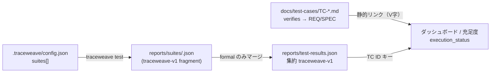

# TraceWeave ワークスペース設定（`.traceweave/`）

このディレクトリは **V 字ドキュメント（`docs/`）とは別レイヤ** の運用設定です。文書が「何を検証するか（静的）」を定義し、ここが「どのランナーで証跡を集めるか（動的）」を宣言します。

契約の正本は `docs/specifications/SPEC-0028.md`（設定と集約）および `docs/specifications/SPEC-0030.md`（formal / supplementary）。本 README はその読み物ガイドです。

---

## 1. スイート（suite）とは何か

**スイート**は「1 回の `traceweave test` 実行の中で、順番に走らせるテスト実行単位」です。

| 概念 | 意味 | 混同しないもの |
|---|---|---|
| **工程（stratum）** | UT / ITa / ITb / ST / UAT。TC ID の接頭辞（`TC-UT-0001` 等） | スイート ID（`node`, `e2e`） |
| **スイート** | ランナー + 作業ディレクトリ + 証跡の取り方（`capture`） | 単一のテストファイル |
| **formal / supplementary** | 集約レポートに載せるか（`evidenceTier`） | `test_level` フロントマター |

1 つのスイートが複数工程の TC を実行してもよい（例: `node` スイートで UT と ITa を同じ Node `test` ランナーに載せる）。逆に、1 工程を複数スイートに分けることもある（例: ITb を Newman スイートと Node 契約テストに分離）。

---

## 2. 二層モデル（静的 / 動的）



- **静的**: TC 文書の `verifies` が REQ/SPEC への効き方を決める。レポートだけでは要件充足にならない。
- **動的**: 集約 `test-results.json` の `results["TC-xxxx"]` が passed / failed 等を供給する。TC 文書が無ければダッシュボードに結び付かない。

---

## 3. ディレクトリ構成

| パス | 役割 |
|---|---|
| `config.json` | ワークスペース正本（本リポジトリの dogfood 設定） |
| `examples/*.json` | コピーして編集する断片例（Web 多層、マルチランナー） |
| `adoption/` | `traceweave adopt` が配備するガイドの正本（`ADOPT_TEST_STRATA_GUIDE.md`） |

証跡の既定出力先は `config.json` の `evidenceDir`（既定 `reports/`）。

- スイートごと: `reports/suites/<suite.id>.json`（fragment）
- 集約: `reports/test-results.json`（`testResults.aggregate`）

最小スキーマ例は `fixtures/test-reports/traceweave-v1-minimal.json`。

---

## 4. `config.json` トップレベル

| フィールド | 既定 | 説明 |
|---|---|---|
| `schemaVersion` | — | 将来の互換用（現行は `1`） |
| `displayName` | — | ダッシュボード表示名 |
| `docsDir` | `docs` | TC / REQ 等のルート（相対パス） |
| `evidenceDir` | `reports` | 証跡ルート |
| `testResults.aggregate` | `<evidenceDir>/test-results.json` | マージ先 |
| `testResults.format` | `traceweave-v1` | 集約・fragment の JSON 形 |
| `coverage.lcov` / `summary` | `reports/lcov.info` 等 | カバレッジ指標のパス |
| `merge.onConflict` | `fail-wins` | 同一 TC ID が複数スイートに出たとき。`last-wins` も可 |
| `suites` | （下記「設定が無いとき」） | スイート配列 |

**設定ファイルが無いとき** CLI はワークスペースを推測します。`tests/` があれば `node-test-tap` の単一 `default` スイート、無ければ `npm test` + `capture: aggregate` の `default` スイートになります。本番運用では明示的な `config.json` を推奨します。

ワークスペース探索: カレントディレクトリから親へ `.traceweave/config.json` を探す。`./bin/traceweave test -w <dir>` または環境変数 `TRACEWEAVE_WORKSPACE` でルートを固定できます。

---

## 5. スイートオブジェクト（`suites[]`）

| フィールド | 必須 | 説明 |
|---|---|---|
| `id` | はい | CLI の `--suite`、fragment ファイル名の一部 |
| `label` | いいえ | 人間向け説明 |
| `cwd` | はい | `run` 実行時の作業ディレクトリ（相対はワークスペースルート基準） |
| `run` | はい* | シェル一行。`*` `capture: node-test-tap` のときは **無視**され、TraceWeave が Node `test` を直接起動 |
| `capture` | いいえ | 証跡の取り方（下表）。省略時は `fragment` 有無で `fragment` または `aggregate` |
| `fragment` | 条件付き | traceweave-v1 を書く／読むパス。既定 `reports/suites/<id>.json` |
| `evidenceTier` | いいえ | `formal`（既定）または `supplementary` |
| `testsDir` | いいえ | **`node-test-tap` のみ**。走査するテストルート。省略時は `tests/` から `support` と `e2e` を除外 |

### `capture` の選び方

TraceWeave は Vitest / pytest 等を直接解釈しません。`capture` は「実行後、どこから traceweave-v1 を得るか」だけを宣言します。

| `capture` | 誰がテストを走らせるか | TC ID の出所 |
|---|---|---|
| `node-test-tap` | TraceWeave（`tsx` + Node 組み込み `test`） | サブテスト**タイトル**から `TC-<STRATUM>-NNNN(-SS)?` を抽出。推奨: 先頭 `TC-UT-0001:` |
| `fragment` | `run` のコマンド（ランナー + 変換スクリプト） | `fragment` JSON の `results` **キー**（TC 文書 ID と一致） |
| `aggregate` | `run` が集約ファイルへ直接書く | 集約パスの `results` キー |

組み込み capture は現行 **`node-test-tap` のみ**。Vitest JSON・JUnit 等はプロジェクト側で traceweave-v1 に変換し、`capture: fragment` で渡します。

### `evidenceTier`

| 値 | fragment | 集約 `test-results.json` | 典型用途 |
|---|---|---|---|
| `formal` | 書く | **マージする** | TC タイトルが `TC-...` の自動テスト、Newman、Playwright 等 |
| `supplementary` | 書いてもよい | **マージしない** | `tests/support/**`、タイトル `support:` の補助ハーネス（ADR-0011） |

supplementary は CI で実行してよいが、ダッシュボードの `execution_status` や充足度の「実行済み」には載りません。

---

## 6. 実行フロー（`./bin/traceweave test`）

1. `config.json` を読み、対象 `suites` を決定（`--suite` でフィルタ可、複数指定可）。
2. 各スイートを**順番に**実行（`--merge-only` のときはスキップし既存 fragment だけ読む）。
3. `evidenceTier: formal` の fragment / aggregate だけを `merge.onConflict` でマージ。
4. いずれかのスイートが非 0 終了なら CLI も非 0。

よく使うコマンド:

```bash
./bin/traceweave test
./bin/traceweave test --suite node --suite e2e
./bin/traceweave test --merge-only
./bin/traceweave test -w /path/to/workspace
```

---

## 7. 本リポジトリのスイート構成（参考）

`config.json` の dogfood 定義の意図:

| `id` | `capture` | `evidenceTier` | 役割 |
|---|---|---|---|
| `node` | `node-test-tap` | formal | `tests/`（`support`・`e2e` 除外）の TypeScript 単体・内結 |
| `support` | `node-test-tap` | supplementary | `tests/support` の補助チェック |
| `e2e` | `fragment` | formal | Playwright → 変換スクリプトが `reports/suites/e2e.json` |
| `newman-api` | `fragment` | formal | Newman / Postman コレクション → API 契約 ITb |

---

## 8. 段階的な導入

1. **最小**: `node` だけ + `capture: node-test-tap`（または単一ランナーなら `scripts/traceweave-capture-test-report.mjs` で集約のみ）。
2. **API 契約**: `newman-api` または ITb 用 Node テストを `fragment` スイートとして追加。
3. **ブラウザ ST/UAT**: `e2e` を `fragment` で追加（Playwright 等）。
4. **補助ハーネス**: `support` を `supplementary` + `testsDir: tests/support` で分離。

コピー用テンプレート:

- 一般的な Web（SPA + API + E2E）: `examples/config.web-application.fragment.json`
- Vitest + Python など異種ランナー: `examples/config.multi-suite.fragment.json`

工程別の「何をどの境界で証明するか」は `adoption/ADOPT_TEST_STRATA_GUIDE.md`（adopt 後は `docs/ADOPT_TEST_STRATA_GUIDE.md`）。

---

## 9. 関連ドキュメント

| ドキュメント | 内容 |
|---|---|
| `USER_GUIDE.md` 3.6 節 | CLI `traceweave test` の概要 |
| `INSTALL_GUIDE.md` 第 5 章 | adopt 品質キットと設定の配備 |
| `docs/specifications/SPEC-0028.md` | 設定・マージの契約全文 |
| `docs/specifications/SPEC-0030.md` | evidence tier |
| `docs/decisions/ADR-0011.md` | supplementary の位置づけ |
| `.cursor/rules/verification-evidence-tiers.mdc` | エージェント向け tier 要約 |
