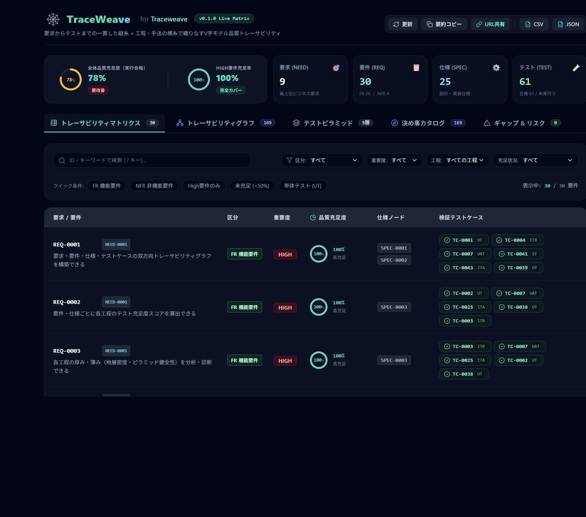
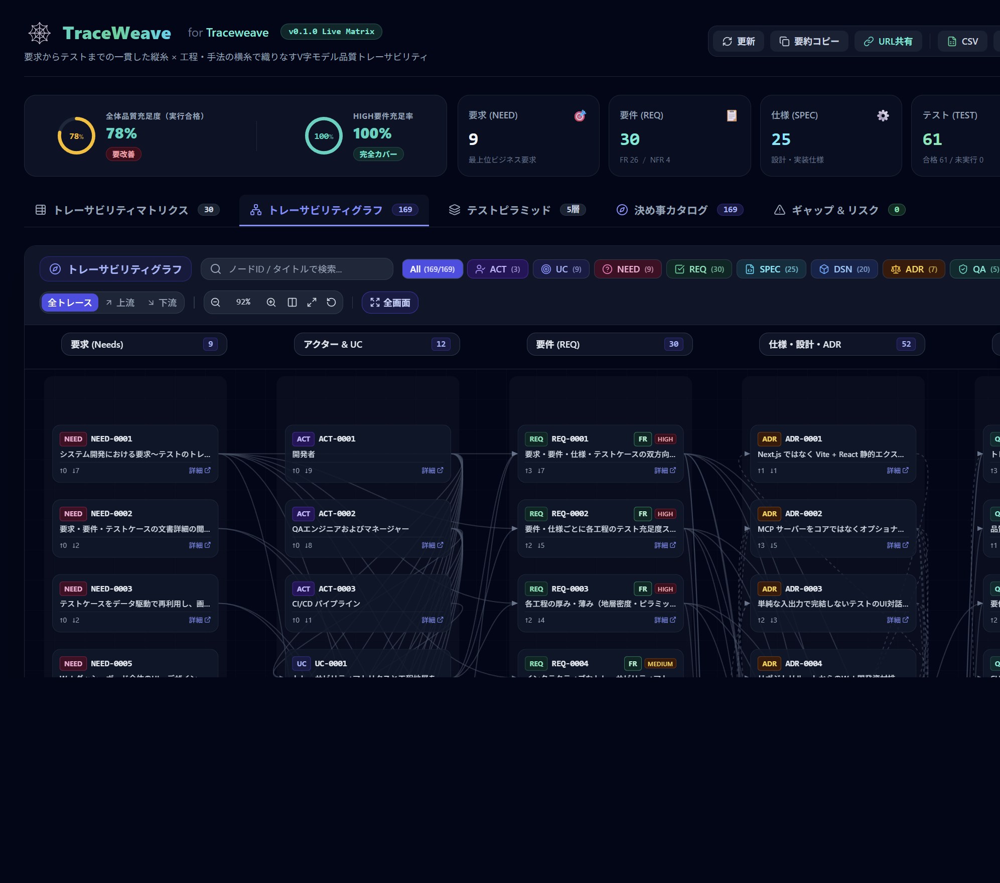
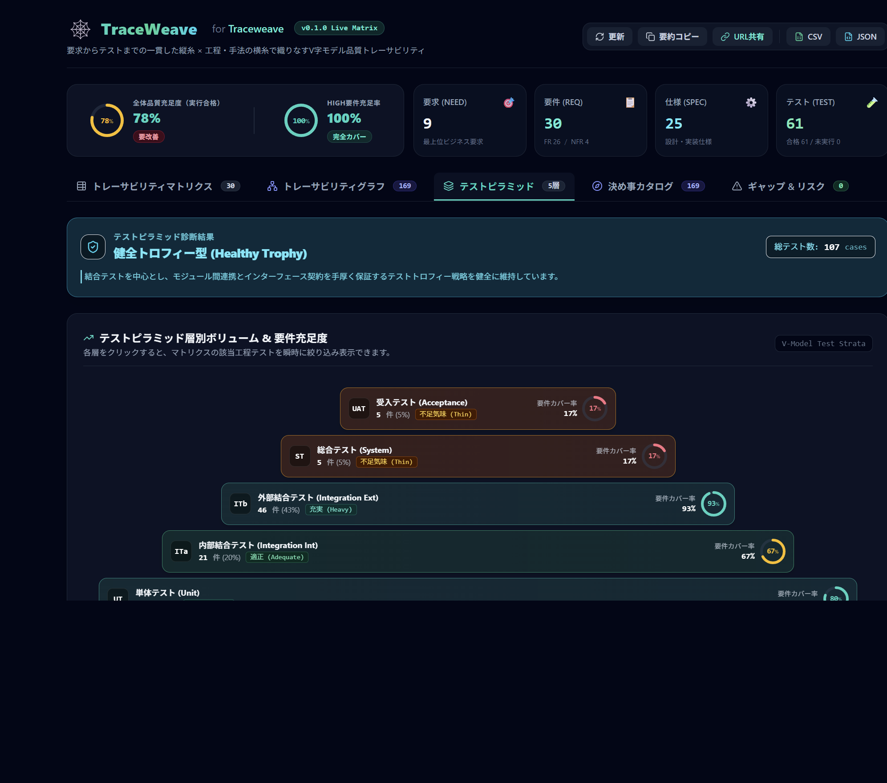
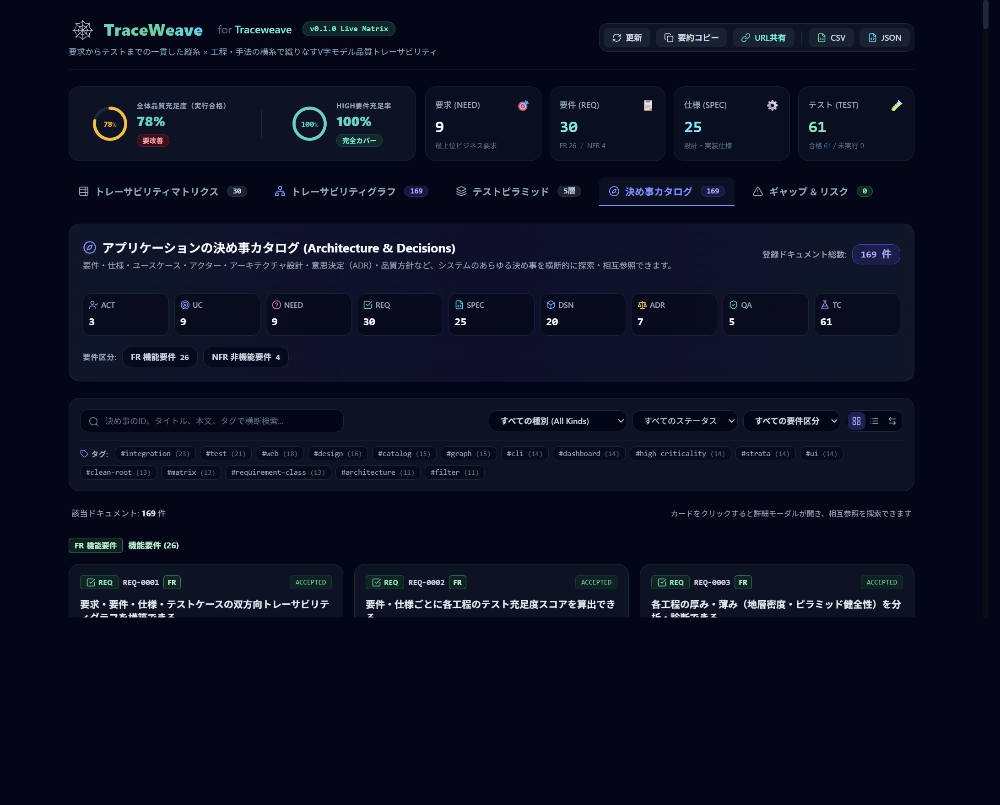
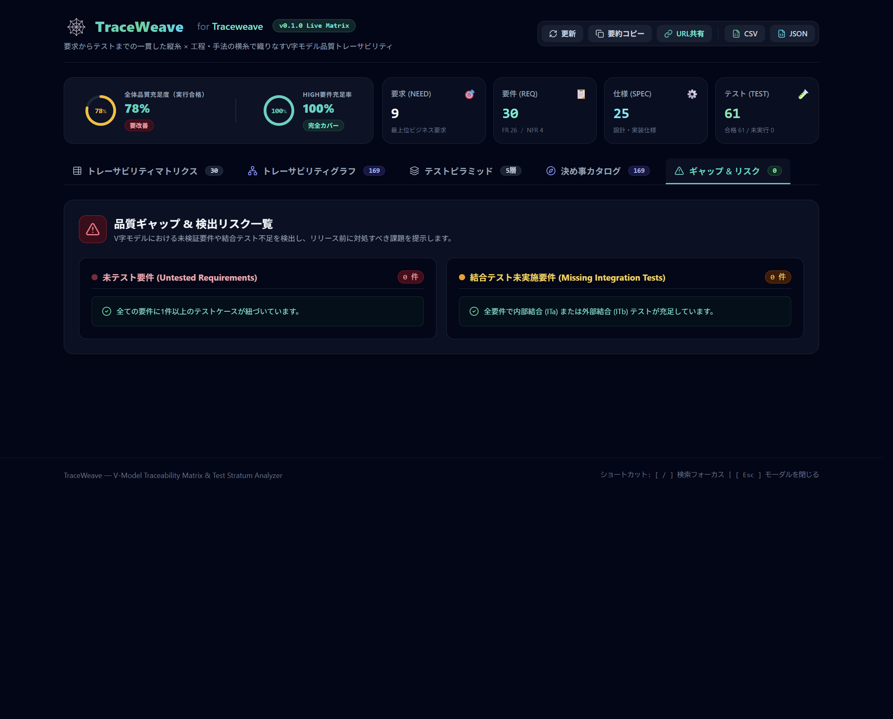

# TraceWeave (トレースウィーブ)

要求からテストまでの双方向トレーサビリティと、開発工程（単体・内結・外結・ST・UAT）および手法ごとの品質充足度・地層密度を可視化する品質保証プラットフォーム。

---

## スクリーンショット

Web ダッシュボード（`traceweave serve` / `traceweave build`）の代表画面です。

### トレーサビリティマトリクス

各要件の品質充足度（円形ゲージ）と、NEED / SPEC / TC へのリンクを表で一覧します。



### トレーサビリティグラフ

V 字モデルの工程順に並べ、ドキュメント間の依存・検証関係をネットワークとして可視化します。



### 工程地層密度 & テストピラミッド

5 大工程（UT / ITa / ITb / ST / UAT）のテスト量と要件カバー率を立体表示します。



### 決め事カタログ

アクター、ユースケース、要件、仕様、設計、ADR など、種別を問わず決め事を横断検索します。



### ギャップ & リスク

未テスト要件や結合テスト欠落など、品質ギャップの抽出結果です。



---

## 1. 概要とコンセプト

TraceWeave は、追いにくくなりがちな「要求からテストまでの追跡性」と「工程ごとのテスト密度の偏り」を、一目で把握できるツールです。

- **縦糸（トレーサビリティ）**: 要求（NEED）→ 要件（REQ）→ 詳細仕様（SPEC）→ 設計（DSN）→ テストケース（TC）の双方向チェーンを、Git で管理する Markdown から自動構築します。
- **横糸（工程地層とテストピラミッド）**: テストを 5 大工程（単体・内結・外結・総合・受入）と手法（Mock、API Contract、Scenario、E2E など）に分類し、層の偏り、結合テストの空洞化、E2E への偏りを診断します。
- **自己適用（ドッグフーディング）**: TraceWeave 自身も同じスキーマで定義しており、自らのトレーサビリティと品質をダッシュボードで可視化しています。

---

## 2. 特徴

1. **Git ネイティブ & ポータブル**:
  - `docs/` 配下の Markdown（YAML フロントマター）が唯一の正本（Single Source of Truth）です。
  - 外部データベースは不要です。リポジトリ単体で完結し、CI でも手元でもそのまま動きます。
2. **高速・軽量・クリーンアーキテクチャ**:
  - ドメインコアは外部依存のない TypeScript のため、単体テストはミリ秒で終わります。
  - `better-sqlite3` キャッシュにより、大量ドキュメントの差分パースも高速です。
  - **React + Vite** によるダッシュボード（ビルド時間 1〜3 秒。静的アセットのみを出力します）。
3. **チーム開発 & CI/CD ファースト**:
  - `traceweave check` で、プルリクエスト時にリンク切れ・循環参照・重要要件のテスト欠落を検知します。
  - `traceweave build` の静的 HTML を GitHub Pages や社内サーバーに置けば、エンジニア・QA・PM がブラウザで閲覧できます。
4. **オプショナルな MCP 拡張**:
  - Cursor などの AI エージェント連携は `traceweave mcp` に分離しており、個人環境に密結合しません。
5. **クリーンなリポジトリ構造（lucid-memories 指針）**:
  - ルート直下にはガバナンス文書、構成マップ、実行ラッパー（`bin/`）だけを置きます。
  - `node_modules`、`dist`、ビルド設定・依存関係（`package.json`, `tsconfig.json`）はすべて `src/` 配下に収めます。

---

## 3. リポジトリ全体配置マップ

```text
traceweave/
├── README.md               # 製品概要、全体構成マップ、クイックスタート
├── INSTALL_GUIDE.md        # インストール & 導入ガイド: 初期セットアップ・外部プロジェクト適用
├── USER_GUIDE.md           # ユーザーガイド: CLI・Web 画面・MCP 連携
├── ARCHITECTURE.md         # アーキテクチャ設計原則、レイヤー責務、システム構造図
├── DEVELOPER_GUIDE.md      # 開発者ガイド: 文書先行プロセス・リポジトリ規約
├── .gitignore              # Git 除外設定（src/node_modules/, src/dist/, .cache/ 等）
│
├── docs/                   # 【製品の決め事】要求・要件・仕様・設計・ADR・品質・テスト
├── fixtures/               # テスト用フィクスチャ
├── scripts/                # 運用・検証スクリプト (validate-docs.ts, test.sh 等)
├── tests/                  # テストスイート
├── bin/                    # 【透過実行ラッパー】
│   ├── traceweave          # POSIX bash ラッパー
│   ├── traceweave.cmd      # Windows cmd ラッパー
│   └── traceweave.ps1      # Windows PowerShell ラッパー
│
└── src/                    # 【アプリケーション実装・依存・成果物】
    ├── package.json        # 依存関係・スクリプト定義
    ├── tsconfig.json       # TypeScript 設定
    ├── node_modules/       # 依存パッケージ群（.gitignore 対象）
    ├── dist/               # コンパイル済み成果物（.gitignore 対象）
    ├── core/               # 純粋 TypeScript コア（外部依存ゼロ）
    ├── application/        # ユースケースオーケストレーション
    ├── infrastructure/     # ファイル I/O・SQLite キャッシュ・レポーター
    ├── cli/                # CLI コマンド受付（Commander.js）
    ├── mcp/                # Cursor / AI エージェント連携用 MCP サーバー
    └── web/                # Web ダッシュボード開発資材・UI
        ├── index.html
        ├── vite.config.ts
        ├── tailwind.config.js
        ├── postcss.config.js
        ├── dist/           # Web ビルド成果物（.gitignore 対象）
        └── src/            # React 19 UI ソースコード
```

---

## 4. クイックスタート

> 💡 **インストールと外部プロジェクト導入**: 前提要件、クローンからの初期セットアップ、グローバルリンク、別プロジェクトへの適用（一時適用／完全再構成）は **[INSTALL_GUIDE.md](INSTALL_GUIDE.md)** を参照してください。  
> 💡 **利用ガイド**: CLI の全オプション、Web ダッシュボードの各ビュー、Cursor / Claude Desktop などとの **MCP サーバー設定** は **[USER_GUIDE.md](USER_GUIDE.md)** を参照してください。

### CLI コマンドの利用

ラッパースクリプト（`bin/traceweave`）を使うと、リポジトリルートから直接コマンドを実行できます。

```bash
# CI 用の静的チェック（不備があれば exit code 1）
./bin/traceweave check

# 外部プロジェクトへの TraceWeave 導入（解析一時適用 or 完全再構成）
./bin/traceweave adopt /path/to/project --mode overlay
./bin/traceweave adopt /path/to/project --mode restructure

# トレーサビリティマトリクスの表示
./bin/traceweave matrix

# アプリケーションの決め事カタログ（全種別の横断探索）
./bin/traceweave catalog
./bin/traceweave catalog --kind actor
./bin/traceweave catalog --kind decision

# アーキテクチャ意思決定（ADR）と設計（DSN）の相互リンク一覧
./bin/traceweave decisions

# 品質充足度および工程地層密度のサマリーレポート
./bin/traceweave report

# 静的 Web ダッシュボードのビルド（src/web/dist/ にアセット生成）
./bin/traceweave build

# ローカルプレビューサーバーの起動 (http://localhost:3000/)
./bin/traceweave serve --port 3000
```

### 開発・検証コマンド

```bash
# ドキュメントスキーマの検証
./src/node_modules/.bin/tsx scripts/validate-docs.ts

# 単体・結合・E2E テストスイートの実行
./scripts/test.sh
# または Windows
.\scripts\test.cmd

# src/ 内での直接開発
npm --prefix src run build
npm --prefix src test
```

---

## 5. ドキュメントスキーマ

`docs/` 配下に次のディレクトリを置き、1 ファイルにつき 1 成果物の Markdown を作成します。

| ディレクトリ                 | 種別 (`kind`)         | ID 接頭辞      | 説明                                       |
| ---------------------- | ------------------- | ----------- | ---------------------------------------- |
| `docs/needs/`          | `need`              | `NEED-xxxx` | 背景・課題・期待する成果（Why）                        |
| `docs/requirements/`   | `requirement`       | `REQ-xxxx`  | 観測可能な成果・受入条件（What / AC）、区分（`requirement_class`: functional / non_functional）、重要度（criticality） |
| `docs/specifications/` | `specification`     | `SPEC-xxxx` | 入出力契約・インターフェース・異常系制約                     |
| `docs/design/`         | `design`            | `DSN-xxxx`  | モジュール構造・データフロー・トレードオフ                    |
| `docs/quality/`        | `quality_assurance` | `QA-xxxx`   | 品質基準・検証方針・完了判定                           |
| `docs/test-cases/`     | `test_case`         | `TC-xxxx`   | 個別検証手順、工程（test_level）、手法（test_method）    |
| `docs/decisions/`      | `decision`          | `ADR-xxxx`  | 設計・アーキテクチャの意思決定ログ                        |

### テストケースのフロントマター例

```yaml
---
schema_version: 3
id: TC-0001
kind: test_case
title: トレーサビリティグラフの多段循環参照検知テスト
status: accepted
created: "2026-09-12"
updated: "2026-09-12"
scope: local
test_level: unit                  # unit | integration_internal | integration_external | system | acceptance
test_method: unit_mock            # unit_mock | property_based | api_contract | scenario | e2e | etc.
verifies: [REQ-0001, SPEC-0002]   # 検証対象の要件・仕様ID
depends_on: []
tags: [core, graph]
links: []
---
## Content

### Objective
...
### Preconditions
...
### Steps
...
### Expected Results
...
### Evidence
...
```

---

## 6. 重要度と品質充足度の算出基準 (Sufficiency Scoring)

ダッシュボード（トレーサビリティマトリクス）とレポートに出る各要件（REQ）の**重要度**と**品質充足度（Sufficiency Score）**は、`SufficiencyScorer` が決定論的に算出します。

### 6.1 要件区分 (`requirement_class`)

要件のフロントマターで必須です。重要度とは別軸です。

- `functional`: 機能要件（FR）。システムが提供する観測可能な振る舞い・成果そのもの。
- `non_functional`: 非機能要件（NFR）。性能、保守性、識別性などの品質特性。

マトリクス・カタログ・詳細では `FR` / `NFR` と表示し、`reqclass` クエリで絞り込めます。

### 6.2 重要度 (`criticality`) の区分

要件ドキュメント（`docs/requirements/REQ-xxxx.md`）のフロントマターで指定します（省略時は `medium`）。

- `high`: システムの根幹・中核機能。単体テストから結合、受入に至る多層的な検証が必須。
- `medium`: 一般的な主要機能（デフォルト）。単体テストと結合 / システムテストの組み合わせが必要。
- `low`: 補助的・周辺機能。いずれか 1 つのテスト工程があれば充足。

### 6.3 紐づくテストケースの集計

各要件（`REQ`）には、次のテストケース（`TC`）が集計されます。

1. **直接検証**: `TC` の `verifies` にその `REQ` が指定されているテスト
2. **仕様（SPEC）経由**: その `REQ` に紐づく詳細仕様（`SPEC`）を検証しているテスト（`verifies: [SPEC-xxxx]`）

### 6.4 重要度別の配点基準と充足判定

集計したテストケースの工程（`test_level`）の有無から、0〜100% のスコアを出します。

| 重要度 (`criticality`) | 必須テスト工程と配点                                                                                                                                                           | 完全充足 (`isFullySatisfied`) の基準                     |
| ------------------- | -------------------------------------------------------------------------------------------------------------------------------------------------------------------- | ------------------------------------------------- |
| **High**            | ・単体テスト (`unit`): **30点** ・内部結合 (`integration_internal`): **25点** ・外部結合 (`integration_external`) または システム (`system`): **25点** ・受入テスト (`acceptance`): **20点** （合計100点） | **スコア 80% 以上** （例: 単体 + 内結 + 外結/ST で80点に達すれば完全充足） |
| **Medium**          | ・単体テスト (`unit`): **50点** ・結合（内/外）または システム (`system`): **50点** ※受入テストが存在する場合はボーナス +10点（上限100点）                                                                        | **スコア 80% 以上** （単体と結合/STの両方が揃えば100点充足）            |
| **Low**             | いずれか1つのテスト工程（単体、内結、外結、ST、受入）が存在すれば **100点**、なければ **0点**                                                                                                              | **スコア 100%**                                      |

### 6.5 ダッシュボードでのステータス表示

スコアに応じて、円形ゲージとステータスラベルを 3 段階で色分けします。

- **充足（緑 / Teal）**: **80% 以上**（各重要度の必須工程基準を満たしている状態）
- **一部充足（黄 / Amber）**: **50% 以上 80% 未満**（単体テストはあるが結合・システムテストが欠落している等）
- **未充足（赤 / Rose）**: **50% 未満**（テストケース未作成、または High なのに単体テスト 30% のみ等）

### 6.6 Web ダッシュボードの主要ビュー

Web ダッシュボード（`traceweave serve` または `traceweave build` による静的 HTML）では、次のビューをタブで切り替えます。

1. **トレーサビリティマトリクス & 実測観測**:
   - 表形式で要求〜要件〜仕様〜テストケースの V 字トレーサビリティを一覧します。
   - 円形ゲージによる品質充足度、多軸フィルター、対話型テストランナー、CSV / JSON エクスポート。
2. **トレーサビリティグラフ (Graph View)**:
   - 全ドキュメントをノード、依存・検証関係を有向エッジとするネットワークグラフ。
   - V 字モデルの工程順に応じたランク別レイアウト（Need → Actor/UseCase → Requirement → Spec/Design/ADR → QA/TestCase）。
   - ズーム・パン、全体を画面に合わせる操作、種別フィルター、ノード選択時の上流・下流パスの強調。
3. **工程地層密度 & ピラミッド診断**:
   - 5 大工程（UT, ITa, ITb, ST, UAT）のテスト量と要件カバー率を立体表示する `VisualTestPyramid`。
   - 逆ピラミッド（アイスクリームコーン）や結合層空洞化（ひょうたん型）の早期検知。
4. **決め事カタログ (Architecture & Decisions)**:
   - アクター、ユースケース、要件、仕様、設計、意思決定（ADR）、品質保証など、種別を問わず決め事を横断検索します。
5. **ギャップ & リスク一覧**:
   - 未テスト要件、結合テスト欠落要件、未検証仕様の抽出。

---

## 7. ライセンス

MIT License
